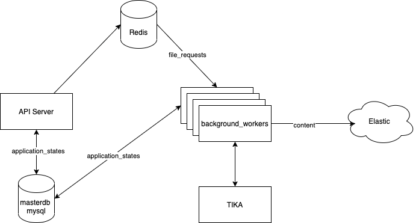

# Cloud Search

CloudSearch allows you to integrate with multiple cloud providers and search within your files.

# Local Setup

## Prerequisites

1. Docker
2. At least 4GB of available RAM

## How to run
`docker-compose up`

# APIs
## Register
### Request:
```
curl --location --request POST 'http://localhost:8080/register' \
--header 'Content-Type: application/json' \
--data-raw '{
	"email": "<email>",
	"password": "<plaintext_password>"
}'
```
### Response:
```
{
	"status": "succcess",
	"message": "Registered Successfully. Please signin to your account"
}
```

## Login
### Request:
```
curl --location --request POST 'http://localhost:8080/login' \
--header 'Content-Type: application/json' \
--data-raw '{
	"email": "<email>",
	"password": "<password>"
}'
```

### Response:
```
{
	"status": "succcess",
	"message": "Logged in successfully",
	"auth_token": "<user_auth_token>"
}
```

## Logout:
### Request:
```
curl --location --request POST 'http://localhost:8080/logout' \
--header 'Authorization: Bearer <user_auth_token>' \
--data-raw ''
```

### Response:
```
{
	"status": "succcess",
	"message": "Successffully logged out."
}
```

## Authorize Provider
### Request:
```
curl --location --request GET 'http://localhost:8080/<provider>/authorize' \
--header 'Authorization: Bearer <user_auth_token>' \
--data-raw ''
```

### Response:
```
{
	"status": "success",
	"authorization_url": "<auth_url>",
	"message": "Please visit the authorization url and login to dropbox"
}
```

### List of Supported Providers:
1. dropbox

## Authenticate Provider
### Request:
```
curl --location --request POST 'http://localhost:8080/<provider>/authenticate' \
--header 'Authorization: Bearer <user_auth_token>' \
--header 'Content-Type: application/json' \
--data-raw '{
	"code": "<auth_code>"
}'
```
### Response:
```
{
	"status": "success",
	"access_token": "<access_token>",
	"message": "Successfully authenticated provider"
}
```

## Start Synchronization
### Request:
```
curl --location --request POST 'http://localhost:8080/<provider>/sync' \
--header 'Authorization: Bearer <user_auth_token>' \
--header 'Content-Type: application/json' \
--data-raw '{
	"access_token": "<access_token>"
}'
```
### Response:
```
{
	"status": "success",
	"message": "Sync successfully started"
}
```

## Get File List
### Request:
```
curl --location --request GET 'http://localhost:8080/files' \
--header 'Authorization: Bearer <user_auth_token>' \
--header 'Content-Type: application/json' \
--data-raw '{
	"access_token": "<access_token>"
}'
```

### Response:
```
{
	"status": "success",
	"results": [
	{
		"id": 1,
		"filename": "Document.docx",
		"filepath": "document.docx",
		"fileurl": "<file_url>",
		"user_id": 1,
		"provider": "dropbox",
		"provider_file_id": "id:abcdef",
		"last_sync_status": "COMPLETED",
		"last_synced_on": "2021-06-01T11:58:23",
		"created_on": "2021-06-01T11:51:58",
		"updated_on": "2021-06-01T11:58:24"
	}
	],
	"count": 1
}
```
## Search
### Request:
```
curl --location --request GET 'http://localhost:8080/search?q=test' \
--header 'Authorization: Bearer <user_auth_token>' \
--header 'Content-Type: application/json' \
--data-raw '{
	"access_token": "<access_token>"
}'
```

### Response:
```
{
	"status": "success",
	"count": 1,
	"results": [
	{
		"file_id": 1,
		"title": "document.docx",
		"provider_file_id": "id:abcdef",
		"provider": "dropbox",
		"file_url": "<file_url>"
	},
]
```
# PRD:
[PRD Document](https://docs.google.com/document/d/11qkfg3Sa6isYh_33aD-E8zuwxef-E2fZuUhiocjD1R0/edit?usp=sharing)

# Architecture:

